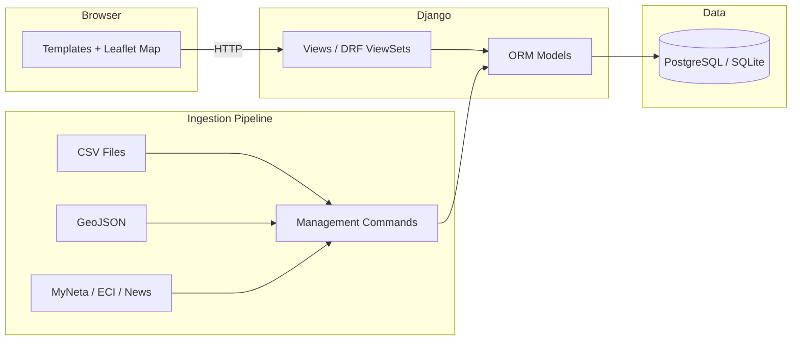

# Tamil Nadu Assembly Elections Tracker

Public transparency site for Tamil Nadu Assembly Elections. Built with Django, Django REST Framework, Leaflet.js, and open-source GIS data for interactive constituency maps. Supports bilingual content (English and Tamil).

**Live data covers:** 2021 official results and 2026 pre-election announcements.

## Tech stack

| Layer       | Technology                                      |
|-------------|--------------------------------------------------|
| Backend     | Django 4.2, Django REST Framework, django-filter |
| Database    | PostgreSQL 16 (prod) / SQLite (local dev)        |
| Frontend    | Django templates, Leaflet 1.9.4, inline JS       |
| Static files| WhiteNoise                                       |
| Scraping    | Playwright, BeautifulSoup, requests, rapidfuzz   |
| Deployment  | Railway (Nixpacks), Docker Compose, Gunicorn     |

No separate JavaScript build step -- all frontend code lives in Django templates.

## Architecture



**Request flow:** Browser hits Django views (template views or DRF API endpoints) which query the ORM and render HTML or return JSON.

**Data flow:** Raw data (CSV files, GeoJSON, web-scraped HTML) is imported via Django management commands into the database, then served through views.

## Repository map

```
tntracker/
├── backend/                         # All Django code
│   ├── manage.py                    # Django management entry point
│   ├── tntracker/                   # Django project package (settings, root URLs)
│   │   ├── settings.py              # Database, middleware, installed apps, i18n
│   │   ├── urls.py                  # Root URL conf (includes core.urls + admin)
│   │   ├── wsgi.py                  # WSGI entry point
│   │   └── asgi.py                  # ASGI entry point
│   └── core/                        # The single Django app
│       ├── models.py                # 17 models (see Models section below)
│       ├── views.py                 # Template views + DRF ViewSets
│       ├── urls.py                  # App URL routes + DRF router
│       ├── serializers.py           # DRF serializers (Party, Constituency, Candidate, Manifesto)
│       ├── admin.py                 # Admin registrations for all models
│       ├── apps.py                  # App config
│       ├── context_processors.py    # Language toggle + data vintage label
│       ├── templates/core/          # 9 HTML templates (see Templates section)
│       ├── static/core/             # CSS, images, party symbol SVGs
│       │   ├── site.css             # Global stylesheet (~1,500 lines)
│       │   ├── logo.png             # Site logo
│       │   ├── map-icon.png         # Feature icon
│       │   ├── candidates-icon.png  # Feature icon
│       │   └── party-symbols/       # 13 SVG party symbols + JSON metadata
│       ├── templatetags/
│       │   └── indian_numbers.py    # |indian filter (lakh/crore grouping) + |get_item
│       ├── ingestion/               # Data-import helper modules
│       │   ├── myneta.py            # MyNeta HTML profile parser
│       │   ├── myneta_import.py     # MyNeta -> DB import logic
│       │   ├── eci_affidavit.py     # ECI affidavit processor
│       │   ├── form21e.py           # Form 21E PDF processor
│       │   ├── geoimport.py         # GeoJSON import utilities
│       │   └── download.py          # HTTP download helpers
│       ├── management/commands/     # 11 management commands (see Data Ingestion)
│       └── migrations/              # 4 migration files (initial through coalitions/manifestos)
│
├── data/                            # Raw data files
│   ├── fct_candidates_21.csv        # 2021 candidates, full (3,911 rows, 15 cols)
│   ├── fct_candidates_16.csv        # 2016 candidates (6 rows, 15 cols)
│   ├── tn_2021_candidates.csv       # 2021 candidates, simplified (6 cols)
│   ├── tn_2021_candidates_extended.csv  # 2021 candidates, extended (14 cols)
│   ├── tn_2026_candidates.csv       # 2026 template (header only, includes review fields)
│   ├── constituencies.geojson       # 233 TN assembly constituency boundaries
│   └── party_symbols/               # Raw party symbol images (PNG, JPG, WEBP, SVG)
│
├── docs/                            # Documentation and data indexes
│   ├── sources.md                   # Data sources with licensing notes
│   ├── manifestos_index_2021.json   # 2021 manifesto index for sync command
│   ├── manifestos_index.sample.json # Sample manifesto index
│   └── promise_assessments_2021.json # Promise assessment data
│
├── scripts/                         # Standalone utility scripts
│   ├── scrape_candidates.py         # MyNeta + OneIndia scraper (Playwright)
│   ├── scrape_2016_candidates.py    # 2016 candidate scraper
│   └── preprocess_extended_2021.py  # CSV preprocessing (asset extraction, MLA flags)
│
├── infra/                           # Deployment infrastructure
│   ├── Dockerfile                   # Python 3.11-slim, Gunicorn
│   ├── docker-compose.yml           # web + db (PostgreSQL 16) + nginx
│   └── nginx.conf                   # Reverse proxy, static file serving
│
├── requirements.txt                 # Python dependencies (pinned ranges)
├── Procfile                         # Heroku/Railway process definitions
├── railway.json                     # Railway deployment config
├── runtime.txt                      # Python 3.11.7
├── .env.example                     # Environment variable template
└── .gitignore                       # Python/Django/IDE ignores
```

## Models

| Model                 | Purpose |
|-----------------------|---------|
| `SourceDocument`      | Tracks provenance of imported data (official, ADR, media) |
| `Election`            | Election year and vintage label |
| `Constituency`        | 234 TN assembly constituencies with GeoJSON boundaries |
| `Party`               | Political parties with symbols and abbreviations |
| `Coalition`           | Party alliances per election |
| `CoalitionMembership` | Many-to-many link between coalitions and parties |
| `Candidate`           | Candidates with status, demographics, education |
| `CandidateResult`     | Election results (votes, vote share, position, winner flag) |
| `Affidavit`           | Candidate affidavit data (criminal cases, assets, liabilities) |
| `LegalCase`           | Individual legal case details per candidate |
| `Manifesto`           | Party/coalition manifesto (state or constituency scope) |
| `ManifestoDocument`   | Manifesto document URLs by language (EN/TA) |
| `ManifestoPromise`    | Individual promises extracted from manifestos |
| `PromiseAssessment`   | Fulfillment status of a promise (state or constituency scope) |
| `PromiseEvidence`     | Evidence links supporting an assessment |
| `PartyFulfilmentClaim`| Party self-reported fulfillment percentages |
| `UpdateLog`           | Audit trail for data changes |

All bilingual models carry `_ta` suffixed fields (e.g. `name_ta`, `summary_ta`).

## URL routes

### Template views

| URL                              | View function            | Description |
|----------------------------------|--------------------------|-------------|
| `/`                              | `home`                   | Landing page with stats and CTAs |
| `/map/`                          | `map_view`               | Interactive Leaflet constituency map |
| `/map/data/`                     | `map_data`               | GeoJSON API for map features |
| `/api/map-search/`              | `map_search`             | Autocomplete search for map |
| `/search/`                       | `search`                 | General search page |
| `/dashboard/`                    | `data_quality_dashboard` | Data completeness metrics |
| `/party-dashboard/`             | `party_dashboard`        | Party-level analytics |
| `/party/<party_name>/`          | `party_detail`           | Party candidate listing |
| `/constituency/<id>/`           | `constituency_detail`    | Constituency detail with candidates |
| `/candidate/<id>/`              | `candidate_detail`       | Candidate profile and legal history |
| `/resources/`                    | `resources`              | External resource links |
| `/set-lang/<en\|ta>/`           | `set_language`           | Language toggle |

### REST API (DRF)

| Endpoint                | ViewSet               |
|-------------------------|-----------------------|
| `/api/constituencies/`  | `ConstituencyViewSet` |
| `/api/parties/`         | `PartyViewSet`        |
| `/api/candidates/`      | `CandidateViewSet`    |
| `/api/manifestos/`      | `ManifestoViewSet`    |

## Templates

All templates live in `backend/core/templates/core/`:

| Template                     | Purpose |
|------------------------------|---------|
| `home.html`                  | Homepage hero, nav, feature cards |
| `map.html`                   | Leaflet map with search, geolocation, tooltips |
| `constituency_detail.html`   | Constituency stats and candidate cards |
| `candidate_detail.html`      | Candidate profile, affidavit, legal history |
| `party_detail.html`          | Party drill-down table with filters |
| `party_dashboard.html`       | Party analytics dashboard with slicers |
| `dashboard.html`             | Data quality/completeness metrics |
| `search.html`                | Search results layout |
| `resources.html`             | External resources |

## Setup

### Local development (SQLite)

```bash
# 1. Clone and enter the repo
git clone <repo-url> && cd tntracker

# 2. Create virtualenv and install dependencies
python -m venv .venv && source .venv/bin/activate
pip install -r requirements.txt

# 3. Copy environment template (SQLite is the default when DATABASE_URL is unset)
cp .env.example .env

# 4. Run migrations
python backend/manage.py migrate

# 5. (Optional) Import seed data
python backend/manage.py import_constituency_geojson data/constituencies.geojson
python backend/manage.py sync_election_data --with-geojson

# 6. Start dev server
python backend/manage.py runserver
```

The site will be available at `http://127.0.0.1:8000/`.

### Docker Compose (PostgreSQL + Nginx)

```bash
cd infra
docker compose up --build

# In a separate terminal, run migrations and collect static files
docker compose exec web python manage.py migrate
docker compose exec web python manage.py collectstatic --noinput
```

The site will be available at `http://localhost/` (port 80 via Nginx).

### Environment variables

| Variable              | Default        | Description |
|-----------------------|----------------|-------------|
| `DJANGO_SECRET_KEY`   | (required)     | Django secret key |
| `DJANGO_DEBUG`        | `true`         | Debug mode |
| `DJANGO_ALLOWED_HOSTS`| `*`           | Comma-separated allowed hosts |
| `DATABASE_URL`        | (unset=SQLite) | PostgreSQL connection string |
| `DATA_VINTAGE_LABEL`  | (unset)        | Optional label shown in the UI |

## Data ingestion commands

All commands are run via `python backend/manage.py <command>`.

| Command | Description |
|---------|-------------|
| `import_constituency_geojson <path>` | Import constituency boundaries from a local GeoJSON file |
| `sync_constituencies_geojson --url=<url>` | Download and import GeoJSON from a URL |
| `import_affidavit_csv <path>` | Import candidate affidavits from CSV |
| `import_results_csv --csv-path=<path>` | Import election results from CSV |
| `sync_tnla2021_form21e` | Download and import Form 21E PDFs (official results) |
| `sync_myneta_candidate --url=<url>` | Import MyNeta legal history for one candidate |
| `sync_myneta_tn2021` | Import MyNeta data for all TN 2021 candidates |
| `sync_ntk_2026_announcements` | Pull 2026 NTK candidate announcements from news sources |
| `sync_manifestos_index --index-path=<path>` | Import manifestos from a JSON index file |
| `sync_promise_assessments` | Import promise fulfillment assessments |
| `sync_election_data --with-geojson` | One-shot sync (2021 official + 2026 announcements + MyNeta) |

**One-shot full import:**

```bash
python backend/manage.py sync_election_data --with-geojson
```

All sync steps are best-effort -- if a source is unreachable, the command logs a warning and continues.

## CSV data schemas

### `fct_candidates_21.csv` / `fct_candidates_16.csv` (full candidate data)

`candidate`, `party`, `criminal_cases`, `education`, `age`, `total_assets`, `liabilities`, `2021_constituency`, `2021_district`, `myneta_url`, `total_assets_rs`, `liabilities_rs`, `sitting_MLA`, `bye_election`, `const_off`

### `tn_2021_candidates.csv` (simplified)

`candidate`, `party`, `criminal_cases`, `education`, `age`, `myneta_url`

### `tn_2026_candidates.csv` (template)

`candidate`, `party`, `criminal_cases`, `education`, `age`, `myneta_url`, `needs_review`, `review_note`

## Bilingual support

Core models include Tamil fields suffixed with `_ta` (e.g. `name_ta`, `summary_ta`, `education_ta`). The language toggle at `/set-lang/ta/` switches the UI to Tamil. Templates conditionally render `_ta` fields when the active language is Tamil.

## Deployment

The project is configured for **Railway** out of the box:

- `Procfile` defines `web` and `release` processes
- `railway.json` sets the Nixpacks builder and start command
- The `web` process runs migrations, collects static files, imports GeoJSON, and starts Gunicorn

For other platforms (Render, Heroku), set `DATABASE_URL` and the app will work with the existing `Procfile`.

## Data sources

See [`docs/sources.md`](docs/sources.md) for official and secondary sources with licensing notes.
